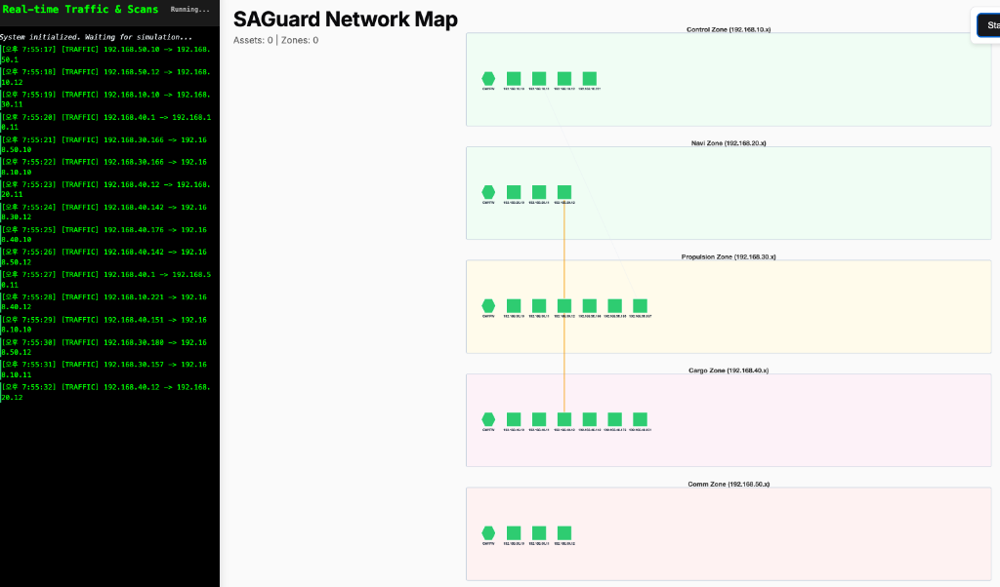

# Auto Network Topology (OT 네트워크 토폴로지 자동 시각화)

## 📋 프로젝트 개요

이 프로젝트는 **Malcolm (Custom Zeek)**을 이용하여 OT(Operational Technology) 망의 네트워크 트래픽을 수집하고, **Cytoscape.js**를 활용하여 실시간으로 네트워크 토폴로지를 자동 생성 및 업데이트하는 **PoC(Proof of Concept) 목업 시스템**입니다.



### 🎯 목적

가상의 Zeek 네트워크 트래픽을 시뮬레이션하여 실시간으로 네트워크 토폴로지가 Cytoscape로 그려지는 것을 검증합니다. 이 목업 시스템은 Malcolm이 트래픽을 수집했다고 가정하고 개발되었습니다.

### ✨ 주요 기능

- ✅ **자동 노드 생성**: 네트워크 트래픽 발생 시 신규 IP 자동 감지 및 노드 추가
- ✅ **실시간 토폴로지 업데이트**: 트래픽 흐름에 따라 동적으로 연결 관계 시각화
- ✅ **노드 상태 모니터링**: 각 노드의 UP/DOWN 상태 실시간 체크 및 표시
- ✅ **Zone 기반 레이아웃**: OT 망의 서브넷별 구역 분리 (5개 Zone)
- ✅ **트래픽 로그**: 실시간 트래픽 및 스캔 이벤트 로그 표시
- ✅ **인터랙티브 UI**: 노드 클릭 시 상세 정보 표시, 줌/팬 기능

---

## 🏗️ 시스템 아키텍처

```
[OT Network Traffic]
        ↓
   [Malcolm/Zeek] ← (이 PoC에서는 시뮬레이션)
        ↓
  [Traffic Data]
        ↓
[Cytoscape.js 시각화]
        ↓
[실시간 토폴로지 맵]
```

### 네트워크 Zone 구성

시스템은 5개의 OT Zone으로 구성되어 있습니다:

| Zone ID | 서브넷 | 설명 | 색상 |
|---------|--------|------|------|
| zone_10 | 192.168.10.x | Control Zone | 연한 녹색 |
| zone_20 | 192.168.20.x | Navigation Zone | 연한 녹색 |
| zone_30 | 192.168.30.x | Propulsion Zone | 연한 노란색 |
| zone_40 | 192.168.40.x | Cargo Zone | 연한 분홍색 |
| zone_50 | 192.168.50.x | Communication Zone | 연한 빨간색 |

각 Zone은 **최대 40개의 노드**(20개/행 × 2행)를 수용할 수 있습니다.

---

## 🚀 시작하기

### 필요 사항

- 웹 브라우저 (Chrome, Firefox, Safari 등)
- 로컬 웹 서버 (선택사항)

### 설치 및 실행

1. **저장소 클론**
```bash
git clone https://github.com/gullivar/Auto_net-topology.git
cd Auto_net-topology
```

2. **웹 서버 실행** (선택사항)
```bash
# Python 3 사용 시
python3 -m http.server 8000

# Node.js 사용 시
npx http-server
```

3. **브라우저에서 열기**
```
http://localhost:8000/index.html
```

또는 `index.html` 파일을 직접 브라우저로 드래그하여 실행할 수 있습니다.

---

## 🎮 사용 방법

### 1. 시뮬레이션 시작

- **Start Sim** 버튼 클릭: 트래픽 시뮬레이션 시작
- **Stop** 버튼 클릭: 시뮬레이션 일시 정지

### 2. 화면 조작

- **Fit Screen**: 전체 토폴로지를 화면에 맞춤
- **Reset**: 페이지 새로고침 (초기 상태로 복원)
- **마우스 휠**: 줌 인/아웃
- **드래그**: 화면 이동
- **더블 클릭**: 화면 자동 맞춤

### 3. 노드 상호작용

- **노드 클릭**: 해당 노드의 상세 정보 표시 (IP, 상태, 타입)
- **노드 색상**:
  - 🟢 **녹색**: 정상 상태 (UP)
  - 🔴 **빨간색**: 다운 상태 (DOWN)

### 4. 로그 패널

좌측 터미널 스타일 패널에서 실시간 이벤트 확인:
- **[TRAFFIC]**: 네트워크 트래픽 발생 (초록색 테두리)
- **[SCAN]**: 노드 상태 스캔 (빨간색 테두리)

---

## 📁 프로젝트 구조

```
Auto_net-topology/
├── index.html              # 메인 HTML 파일
├── app.js                  # 핵심 로직 (Cytoscape 초기화, 시뮬레이션)
├── styles.css              # 스타일시트 (SAGuard 디자인 시스템)
├── README.md               # 프로젝트 문서
├── Dashboard_design.pptx   # 디자인 문서
└── md_file/                # 개발 문서
    ├── DEV_PROGRESS_LOG.md
    ├── OT_Network_Topology_Design.md
    ├── PHASE_1_DEV_PLAN.md
    ├── PoC_Development_Prompts.md
    └── USER_REQUEST_HISTORY.md
```

---

## 🔧 기술 스택

### 프론트엔드
- **HTML5**: 구조
- **CSS3**: 스타일링 (SAGuard 디자인 시스템 기반)
- **JavaScript (ES6+)**: 로직

### 라이브러리
- **[Cytoscape.js](https://js.cytoscape.org/) v3.23.0**: 그래프 시각화
- **Cytoscape Extensions**:
  - `cytoscape-fcose`: 레이아웃 알고리즘
  - `cytoscape-grid-guide`: 그리드 가이드

### 디자인
- **Google Fonts (Inter)**: 타이포그래피
- **SAGuard 디자인 시스템**: 색상 팔레트 및 컴포넌트

---

## 💡 핵심 기능 상세

### 1. 자동 노드 생성 (`ensureNodeExists`)
```javascript
// 트래픽에서 감지된 IP가 없으면 자동 생성
function ensureNodeExists(ip) {
    if (knownIPs.has(ip)) return;
    const subnet = ip.split('.').slice(0, 3).join('.');
    const zone = OT_ZONES.find(z => z.subnet === subnet);
    createNode(subnet, ip.split('.')[3], zone.id);
}
```

### 2. 실시간 트래픽 시뮬레이션 (`simulateTrafficEvent`)
- 1초마다 랜덤 트래픽 생성
- 30% 확률로 신규 IP 생성, 70% 확률로 기존 IP 사용
- 트래픽 발생 시 엣지(연결선) 생성 및 애니메이션

### 3. 노드 상태 모니터링 (`simulateScanEvent`)
- 5% 확률로 랜덤 노드 스캔
- 10% 확률로 DOWN 상태 시뮬레이션
- 노드 색상 변경 (녹색 ↔ 빨간색)

### 4. 엣지 자동 정리 (`pruneStaleEdges`)
- 1.5초 동안 트래픽이 없는 연결선 자동 제거
- 토폴로지 맵을 깔끔하게 유지

### 5. Zone 기반 레이아웃 (`getNextSlotPosition`)
- 각 Zone 내에서 20×2 그리드 레이아웃
- 신규 노드는 빈 슬롯에 자동 배치
- Zone 간 250px 간격 유지

---

## 🎨 UI/UX 특징

### 디자인 철학
- **프리미엄 느낌**: SAGuard 디자인 시스템 기반
- **직관적 인터페이스**: 최소한의 학습으로 사용 가능
- **실시간 피드백**: 애니메이션 및 색상 변화로 상태 표시

### 색상 시스템
```css
--foreground: #09090b;      /* 거의 검정 (텍스트) */
--primary: #18181b;         /* 다크 그레이 (버튼) */
--destructive: #ef4444;     /* 빨간색 (위험) */
--border: #e4e4e7;          /* 연한 회색 (테두리) */
```

### 애니메이션
- 노드 생성 시 크기 확대 애니메이션 (300ms)
- 트래픽 발생 시 엣지 하이라이트 (500ms)
- 버튼 호버 효과 (200ms)

---

## 📊 시뮬레이션 파라미터

| 파라미터 | 값 | 설명 |
|----------|-----|------|
| `SIM_INTERVAL_MS` | 1000ms | 시뮬레이션 주기 |
| `EDGE_TIMEOUT_MS` | 1500ms | 엣지 타임아웃 |
| `NODES_PER_ROW` | 20 | 행당 노드 수 |
| `ROWS_PER_ZONE` | 2 | Zone당 행 수 |
| `MAX_NODES_PER_ZONE` | 40 | Zone당 최대 노드 |
| `ZONE_GAP` | 250px | Zone 간 간격 |

---

## 🔮 향후 계획

### Phase 2: Malcolm 연동
- [ ] Malcolm Zeek 로그 파싱
- [ ] Elasticsearch 연동
- [ ] 실제 네트워크 트래픽 데이터 수집

### Phase 3: 고급 기능
- [ ] 노드 필터링 및 검색
- [ ] 트래픽 통계 대시보드
- [ ] 이상 탐지 알고리즘
- [ ] 히스토리 재생 기능

### Phase 4: 배포
- [ ] Docker 컨테이너화
- [ ] 백엔드 API 개발
- [ ] 다중 사용자 지원

---

## 🤝 기여하기

이슈 및 풀 리퀘스트를 환영합니다!

1. Fork the Project
2. Create your Feature Branch (`git checkout -b feature/AmazingFeature`)
3. Commit your Changes (`git commit -m 'Add some AmazingFeature'`)
4. Push to the Branch (`git push origin feature/AmazingFeature`)
5. Open a Pull Request

---

## 📝 라이선스

이 프로젝트는 MIT 라이선스 하에 배포됩니다.

---

## 👥 개발자

**SAGuard Team**

- GitHub: [@gullivar](https://github.com/gullivar)
- Project Link: [https://github.com/gullivar/Auto_net-topology](https://github.com/gullivar/Auto_net-topology)

---

## 📚 참고 자료

- [Cytoscape.js Documentation](https://js.cytoscape.org/)
- [Malcolm Network Traffic Analysis](https://github.com/cisagov/Malcolm)
- [Zeek Network Security Monitor](https://zeek.org/)

---

## 🙏 감사의 말

이 프로젝트는 OT 네트워크 보안 강화를 위한 연구의 일환으로 개발되었습니다.

---

**Made with ❤️ for OT Network Security**
