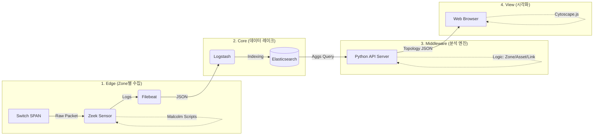

# [설계안] OT 네트워크 자동 토폴로지 및 자산 식별 시스템

## 1. 개요 (Overview)

- **목표:** 상용 솔루션(Nozomi Networks 등) 수준의 OT 네트워크 가시성 확보.
- **핵심 접근:** 능동 스캔(Active Scanning)을 배제하고, **미러링 트래픽 기반의 수동 탐지(Passive Discovery)** 방식을 사용하여 운영 망 가용성을 보장.
- **기반 기술:** 기존 보유 중인 **Zeek + Elastic** 인프라에 **Malcolm의 분석 지능(Scripts)**과 **Cytoscape.js의 시각화** 기술을 통합.

---

## 2. 전체 시스템 아키텍처 (System Architecture)

시스템은 크게 **수집(Edge)**, **저장(Core)**, **분석(Middleware)**, **시각화(Presentation)**의 4계층으로 구성됩니다.

---

## 3. 계층별 상세 설계

### **Step 1. 수집 계층 (Sensor Layer)**

각 Zone(구역)별로 설치되는 경량화된 수집 센서입니다.

- **하드웨어/OS:** 리눅스 기반 범용 서버 (또는 VM).
- **핵심 소프트웨어:** **Zeek (Network Security Monitor)**.
- **기능 확장 (핵심):** **Malcolm Zeek Scripts** 탑재.
    - 기존 순정 Zeek에 Malcolm의 `ICS/OT Protocol Parsers` 및 `Asset Inventory Scripts`를 이식.
    - **역할:** 패킷을 분석하여 단순 통신 로그뿐만 아니라, **제조사, 모델명, 펌웨어, 시리얼 번호** 등의 자산 정보를 추출(Enrichment).
- **데이터 전송:** **Filebeat**를 사용하여 생성된 로그(`conn.log`, `software.log`, `known_services.log` 등)를 중앙으로 실시간 전송.

### **Step 2. 저장 계층 (Storage Layer)**

수집된 대용량 로그를 중앙에서 처리하고 저장합니다.

- **Logstash:**
    - 수집된 로그의 필드 타입 변환 (예: Port `80` 문자열 → `80` 정수형).
    - 필요 시 데이터 정제 및 태깅.
- **Elasticsearch:**
    - 시계열 데이터 저장.
    - 대규모 데이터의 고속 집계(Aggregation) 검색 지원.

### **Step 3. 분석 미들웨어 (Analysis Layer)**

Elasticsearch와 프론트엔드 사이의 두뇌 역할을 하는 API 서버입니다.

- **언어:** Python (FastAPI 또는 Flask 권장).
- **주요 로직:**
    1. **데이터 집계 (Aggregation):** 최근 N분간의 통신 데이터를 요약하여 `Source IP`, `Dest IP`, `Port`, `Protocol`, `Count` 추출.
    2. **자산 매핑 (Enrichment):** IP를 Key로 하여 `asset.*` 정보(제조사, 타입 등)를 조회 및 병합.
    3. **구역 할당 (Zone Mapping):** 사전 정의된 IP 대역(Subnet) 규칙에 따라 각 노드에 `parent` 속성(Zone ID) 부여.
    4. **JSON 변환:** Cytoscape.js가 요구하는 포맷(`{ data: { id: "...", source: "...", target: "..." } }`)으로 변환.
    5. **Diff 업데이트:** 전체 데이터 재전송 대신, 신규 추가된 노드/링크 정보만 필터링하여 전송(옵션).

### **Step 4. 시각화 계층 (Visualization Layer)**

사용자에게 보여지는 웹 인터페이스입니다.

- **라이브러리:** **Cytoscape.js**.
- **레이아웃 확장:** **`cytoscape-fcose` (Fast Compound Spring Embedder)** 필수 사용.
    - 기능: 노드 간의 응집력을 계산하여 같은 그룹(Zone)끼리 뭉치게 하고, 전체적인 균형을 자동으로 맞춤.
- **표현 요소:**
    - **Node:** 장비 아이콘(제조사 로고), 라벨(IP/Hostname), 상태 표시(Color).
    - **Edge:** 통신 선. 트래픽 양에 따른 선 굵기 변화, 프로토콜 종류에 따른 색상 변화.
    - **Compound Node (Group):** Zone별 박스 영역 표시 (엔진룸, 브릿지 등).

---

## 4. 데이터 흐름 (Data Flow)

1. **패킷 유입:** 미러링 포트 → Zeek 인터페이스.
2. **분석 및 식별:**
    - Zeek Core: "A와 B가 통신함" 감지.
    - **Malcolm Scripts:** "B는 Siemens S7-1500 PLC임" 식별.
3. **로그 적재:** `conn.log` + `asset` 정보 → Elastic 저장.
4. **쿼리 및 가공:** Python 미들웨어가 "현재 활성 통신 목록 + 자산 정보" 쿼리 및 Graph JSON 변환.
5. **렌더링:** 브라우저(Cytoscape)가 JSON을 수신하여 `fcose` 레이아웃 알고리즘으로 화면에 자동 배치.

---

## 5. 주요 이슈 및 해결 전략 (Risk Management)

| 이슈 항목 | 설명 | 해결 전략 (Solution) |
| --- | --- | --- |
| **L2 토폴로지 한계** | 패킷 분석만으로는 물리적 스위치 포트 연결 정보를 알기 어려움 | **논리적(Logical) 토폴로지에 집중.** 물리적 배선도 대신 "어떤 장비끼리 통신하는가"를 시각화. (Nozomi 방식과 동일) |
| **스위치(Hub) 표현** | Unmanaged 스위치는 IP가 없어 Zeek에 안 잡힘 | **가상 노드 추론.** 다수의 노드가 특정 경로로 트래픽이 모이면, Python 로직에서 가상의 'Switch Node'를 생성하여 연결. |
| **대규모 노드 성능** | 노드 1,000개 이상 시 브라우저 렉 발생 가능 | **데이터 필터링 & Aggregation.** 백엔드에서 중요도 낮은 링크 생략, Zoom Level에 따라 디테일 조절. |
| **실시간성** | Zeek 로그는 연결 종료 시 생성됨 (Latency) | **Long Connection 설정 튜닝.** Zeek 설정에서 긴 세션도 주기적으로 중간 로그를 남기도록 설정. |

---

## 6. 결론 및 기대 효과

이 설계안은 **"Malcolm의 OT 분석 능력"**과 **"Cytoscape.js의 표현력"**을 결합하여, 고비용의 상용 솔루션을 오픈소스 기반으로 내재화하는 최적의 모델입니다.

- **비용 효율성:** 기존 하드웨어 및 Elastic 인프라 재사용.
- **운영 안정성:** Passive 방식이므로 OT 제어망에 부하를 주지 않음.
- **가시성 확보:** 단순 IP 목록이 아닌, **"제조사/모델명이 포함된 논리적 통신 지도"** 확보 가능.

이제 이 설계 문서를 바탕으로 **[1단계: 센서 서버에 Malcolm 스크립트 이식]**부터 진행하시면 됩니다.
